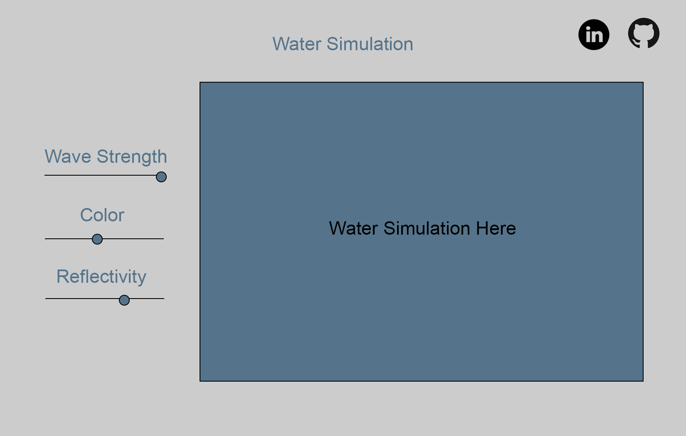

# WebGL Water Simulation

## Overview

WebGL Water Simulation is exactly as it sounds. It is a visualization of water. Rendered using WebGL and GLSL. 
Users will be able to interact with the world in a normal 3D way (rotating the view, zooming in/out). 
Users will also be able to change the uniform variables allowing for the water to change. Options will include (wave height, color, reflectiveness).

## MVPS 
  - WebGL Functional
  - Water Simulation

## Wireframes
This app will be a single page with a simulation playing. Sliders will be available to change what is happening. There will also be links to my github and linkedin.

## Technologies
- React for the UI
- Vanilla JavaScript and GLSL for rendering on the canvas
- Sass for styling
- Webpack to bundle everything together

## Timeline

Weekend
  - Research webgl
  - Get a triangle rendering on the screen using shaders

Day 1 
  - Create WebGL file that handles all the generic webgl functionality. Loading shaders, changing uniform values, etc...

Day 2 
  - Get a plane rendering with a texture on it
  - Have sliders that affect how the plane looks
Day 3 
  - Make the plane vertices change overtime 

Day 4
  - Research and find a function that simulates waves relatively well

Day 5
  - Transparency and reflections with skybox