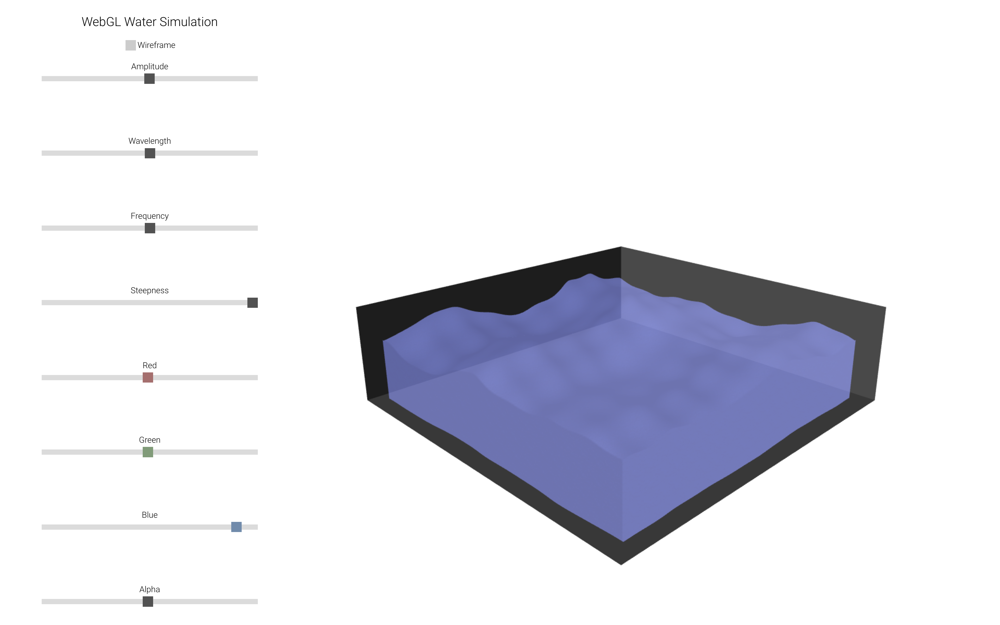
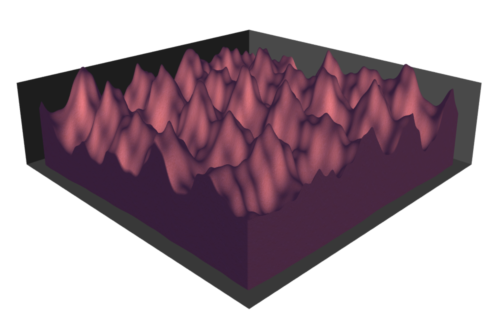
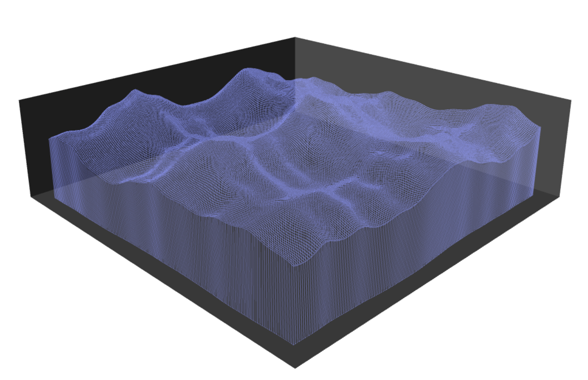

# [WebGL Water Simulation](https://gtongue.github.io/WebGLWater/)

## Overview

WebGL Water Simulation is a visualization of waves. Rendered using WebGL and GLSL.

## Features

- ### Control Wave Properties
  Use the available sliders to change how the wave displays
  - Amplitude
  - Frequency
  - Wavelength
  - Steepness
  - Color
  - Transparency


- ### Moving Camera
  Use the arrow keys to rotate the view or tilt the camera up and down
- ### Wireframe View
  Check the box at the top to enable wireframe mode.



## Gerstner Waves
To generate the wave I use grestner waves. This allows me to have steep peaks on the waves instead of always curved like a normal sign wave.
- S = Steepness 
- A = Amplitude 
- W = Wavelength 
- F = Frequency
- D = Direction

```glsl
void gerstnerWave(float S, float A, float W, float F, vec2 D){
  float w = 2.0*3.141592/W;
  S = S * steepness;
  float Q = S / (w * A);
  float dotD = dot(position.xz, D);

  float cosine = cos(w * dotD + time * F);
  float sine = sin(w * dotD + time * F);

  vec3 wave = vec3(position.x + (Q * A * D.x * cosine) , A * sine, position.z + (Q * A* cosine * D.y));

  waves += wave;

  vec3 waveNormal = vec3((D.x * w * A * cosine), 1.0 - (Q * w * A * sine), -(D.y * w * A * cosine));

  waveNormals +=  waveNormal;
  numWaves++;
}
```

Here are examples of this function being used to generate multiple waves
- The amplitude, wavelength, and frequency here are the values from the sliders
```glsl
gerstnerWave(1.0, amplitude*.3, wavelength, frequency, vec2(0.0,1.0));
gerstnerWave(1.0, amplitude*.2, wavelength, frequency, vec2(.3,.7));
gerstnerWave(1.0, amplitude*.3, wavelength, frequency*.7, vec2(.8,.2));
```